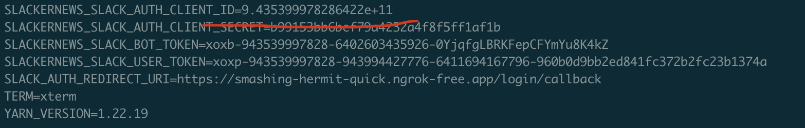

Making the GHA build configurable
-------------------

Some changes to allow for building dev versions of slackernews off of a forked repo with a different vendor.replicated.com account.

- Update logic during GHA build to 

```diff
.github/workflows/tag.yaml

                 type=ref,event=branch
                 type=ref,event=tag
                 type=ref,event=pr
-          images: ${{ env.REGISTRY }}/slackernews/slackernews-web
+          images: ${{ env.REGISTRY }}/${{ secrets.GHCR_NAMESPACE }}/slackernews-web
```

- Make registry CNAME (`images.slackernews.io`) optional. 
  I've set `REPLICATED_PROXY_REGISTRY_CNAME` to `images.slackernews.io` in the upstream repo.

```diff
.github/workflows/tag.yaml

         with:
           include: 'chart/slackernews/values.yaml'
           find: '$REGISTRY'
-          replace: 'images.slackernews.io'
+          replace: ${{ secrets.REPLICATED_PROXY_REGISTRY_CNAME || 'proxy.replicated.com' }}
```

- Update the `$IMAGE` replacement logic to allow for templating the `REPLICATED_APP` as well as the `GHCR_NAMESPACE`. 
  The upstream repo values have been set to `slackernews` and slackernews`.

```diff
.github/workflows/tag.yaml

       - name: Update the values.yaml with the image path
         uses: jacobtomlinson/gha-find-replace@v2
         with:
           include: 'chart/slackernews/values.yaml'
           find: '$IMAGE'
-          replace: 'proxy/slackernews/ghcr.io/slackernews/slackernews-web:${{ steps.get_version.outputs.version-without-v }}'
+          replace: 'proxy/${{ secrets.REPLICATED_APP }}/ghcr.io/${{ secrets.GHCR_NAMESPACE }}/slackernews-web:${{ steps.get_version.outputs.version-without-v }}'
           regex: false
```


- Update the "Create unstable release" action invokation to use the REPLICATED_APP secret.

```diff
       - name: Create the unstable release
         uses: replicatedhq/action-kots-release@configurable-endpoint
         with:
-          replicated-app: "slackernews"
+          replicated-app: ${{ secrets.REPLICATED_APP }}
```

Image registry simplifications
-------------------

There were a lot of `HasLocalRegistry | ternary` functions in the `kots/slackernews-chart.yaml` file. I've simplified them to just use the `LocalImageName` function.

```diff
        repository: repl{{ LocalImageName "$IMAGE" }}
```

I tested this in a variety of scenarios:

### proxy in HelmChart CR vs. LocalImageName

I tried both of the following to confirm they result in the same final value being passed to the slackernews Helm Chart:

```yaml
repository: repl{{ LocalImageName "proxy.replicated.com/proxy/slackernews-dexter-s-version/ghcr.io/dexhorthy/slackernews-web:TAG" }}
```

and

```yaml
repository: repl{{ LocalImageName "ghcr.io/dexhorthy/slackernews-web:TAG" }}
```

I confirmed both result in the same value passed to the chart, so I went with the latter as it requires less templating logic.


From there, the only logic needed is to wire in the image name to the KOTS HelmChart Custom Resource during the GHA build:

```diff
.github/workflows/tag.yaml
           
+      - name: Update the KOTS HelmChart CR with the image path
+        uses: jacobtomlinson/gha-find-replace@v2
+        with:
+          include: 'kots/slackernews-chart.yaml'
+          find: '$IMAGE'
+          replace: 'ghcr.io/${{ secrets.GHCR_NAMESPACE }}/slackernews-web:${{ steps.get_version.outputs.version-without-v }}'
+          regex: false
```

And we get to simplify to:

```diff
kots/slackernews-chart.yaml

-        repository: '{{repl HasLocalRegistry | ternary LocalRegistryHost "images.slackernews.io" }}/{{repl Has
LocalRegistry | ternary LocalRegistryNamespace "proxy/slackernews/ghcr.io/slackernews" }}/slackernews-web'
+        repository: repl{{ LocalImageName "$IMAGE" }}
```

The previous version was also missing a tag, and always deployed `latest`, which may or may not have been intentional. 


I also removed the `repository` templates for `api` and `migrations`:


```diff
kots/slackernews-chart.yaml


-      slackernews_api:
-        pullSecret: repl{{ ImagePullSecretName }}
-        repository: '{{repl HasLocalRegistry | ternary LocalRegistryHost "images.slackernews.io" }}/{{repl Has
LocalRegistry | ternary LocalRegistryNamespace "proxy/slackernews/ghcr.io/slackernews" }}/slackernews-api'
-      slackernews_migrations:
-        pullSecret: repl{{ ImagePullSecretName }}
-        repository: '{{repl HasLocalRegistry | ternary LocalRegistryHost "images.slackernews.io" }}/{{repl Has
LocalRegistry | ternary LocalRegistryNamespace "proxy/slackernews/ghcr.io/slackernews" }}/slackernews-migration
s'
```

I also tested `{{ LocalImageName "$IMAGE" }}` workflow in the case where a default proxy registry CNAME is set on the application. After configuring `slackernews.dexhorthy.com` as a custom domain for `proxy.replicated.com`, and setting it as my "default", I created a new release, here's the slackernews-chart.yaml HelmChart CR in the release that was produced by GHA for the above case (replacing `$IMAGE`).


And here's that being rendered correctly into values that use my custom domain:


Postgresql Wiring
-------------------

- adjust kots HelmChart CR to properly pass in deploy_postgres value so the chart uses it properly. Based on the existing config screen, I'm assuming we never want to allow `sqlite` as the deployment in KOTS, so I'm hardcoding `postgres.enabled` (which controls which db slackernes uses) to `true` in the HelmChart CR. We can adjust that going forward if we want to allow for a `sqlite` workflow in KOTS, but I don't see a compelling enough use case to maintain that extra complexity in the configuration workflow right now.

```diff
kots/slackernews-chart.yaml

   values:
     postgres:
+      enabled: true
+      deploy_postgres: repl{{ ConfigOption "deploy_postgres" | ParseBool }}
       password: repl{{ ConfigOption "postgres_password"}}
+      uri: repl{{ ConfigOption "postgres_external_uri" }}

```

- I have not yet tested the "external postgres URI configuration", neither before nor after making this change. 

Admin User Changes
-------------------

Trying to streamline initial setup, so I don't have to manually run queries to give myself admin permissions. This was a scrappy solution for a problem with a lot of possible approaches.

- Add parameter `SLACKERNEWS_ADMIN_USER_EMAILS` to automatically bootstrap a set of comma-separated email addresses
- Update user.ts to check if superadmin bit is overriden by env var, and automatically flip it when fetching a user

```diff
slackernews/lib/user.ts

+    // when fetching a user, update their superAdmin bit if it's in the hardcoded list of emails
+    const hardCodedSuperAdmins = (process.env.SLACKERNEWS_ADMIN_USER_EMAILS || "").split(",");
+    const isSuperAdmin = hardCodedSuperAdmins.indexOf(user.email_address) !== -1;
+    if (isSuperAdmin && !user.is_super_admin ) {
+      console.log(`flipping on super-admin permissions for user ${id} because their email was present in SLACKERNEWS_ADMIN_USER_EMAILS`)
+      await setUserAdmin(user.id, true);
+    }
+
```


- Wire through kots/config.yaml, kots/slackernews-chart.yaml, charts/slackernews/values.yaml, charts/slackernews/templates/slackernews-deployment.yaml


```diff
kots/config.yaml

+    - name: admin_users
+      title: Admin Users
+      description: |
+        For this section, you can specify a list of users that will be granted admin access to SlackerNews.
+        Provide a comma-separated list of email addresses for the users you want to grant admin access to.
+        Since SlackerNews users Slack for authentication, these email addresses must match the users' email addresses in Slack.
+
+        Users on this list will be able to access the `/admin` route, allowing them to manage content, users, and settings.
+
+        For any users who receive admin permissions from this setting, the change will take effect the next time
+        they are active in the slackernews application.
+      items:
+        - name: slackernews_admin_user_emails
+          title: Admin Users
+          type: text
```

```diff
kots/slackernews-chart.yaml

     slackernews:
       domain: repl{{ ConfigOption "slackernews_domain" }}
+      adminUserEmails: repl{{ ConfigOption "slackernews_admin_user_emails" | quote }}
```


```diff
charts/slackernews/values.yaml

 slackernews:
   domain: ""
+  adminUserEmails: ""
```


```diff
charts/slackernews/templates/slackernews-deloyment.yaml

+          - name: SLACKERNEWS_ADMIN_USER_EMAILS
+            value: {{ .Values.slackernews.adminUserEmails | quote }}
```

- Test locally with `npm run dev` and with a KOTS deployment in CMX EKS


Slack config values in HelmChart CR
---------------------


Added some config options to KOTS config to allow for configuring the slack app.

```diff
kots/config.yaml


+    - name: slack
+      title: Slack Settings
+      description: |
+        If desired, you can preconfigure the slack settings for SlackerNews.
+        These are required for logging into SlackerNews and pulling/organizing content from your slack instance.
+        If you don't preconfigure these settings, you'll be prompted to configure them when you first access SlackerNews.
+
+        Instructions on how to configure your slack application and collect these values can be found in [the SlackerNewa slack documentation](https://docs.slackernews.io/slack/).
+      items:
+        - name: slack_clientid
+          title: Slack Client ID
+          type: text
+        - name: slack_clientsecret
+          title: Slack Client Secret
+          type: password
+        - name: slack_user_token
+          title: User OAuth Token
+          type: password
+        - name: slack_bot_token
+          title: Bot User OAuth Token
+          type: password
```

#### resolving quoting issues

There were some quoting issues where the config screen value was handled correctly


But when being passed to the helm chart values, it got parsed as a number:



I added some quoting to the HelmChart CR to fix this:

```diff
kots/slackernews-chart.yaml

     slack:
-      botToken: repl{{ ConfigOption "slack_bot_token" }}
-      userToken: repl{{ ConfigOption "slack_user_token" }}
-      clientId: repl{{ ConfigOption "slack_clientid" }}
-      clientSecret: repl{{ ConfigOption "slack_clientsecret" }}
+      botToken: repl{{ ConfigOption "slack_bot_token" | quote }}
+      userToken: repl{{ ConfigOption "slack_user_token" | quote }}
+      clientId: repl{{ ConfigOption "slack_clientid" | quote }}
+      clientSecret: repl{{ ConfigOption "slack_clientsecret" | quote }}
```


Clean up Trivy Build
---------------------

Remove the api and migrations builds in trivy. As far as I can tell though, the web one still doesn't work.

NGINX updates
---------------------

- Update `service.type` value to only configure the slackernews `Service` - now the nginx `Service` honors `nginx.service.type` instead (similar for nodePort)


```diff
diff --git a/chart/slackernews/templates/nginx-service.yaml b/chart/slackernews/templates/nginx-service.yaml
index 3dd835f..6d5efcd 100644
--- a/chart/slackernews/templates/nginx-service.yaml
+++ b/chart/slackernews/templates/nginx-service.yaml
@@ -17,5 +17,5 @@ spec:
 {{ end }}
   selector:
     app: slackernews-nginx
-  type: {{ .Values.service.type }}
+  type: {{ .Values.nginx.service.type }}
```


```diff
charts/slackernews/values.yaml

 nginx:
   enabled: false
+  service:
+    type: ClusterIP
+    nodePort:
+      port:
+
 service:
   type: ClusterIP
   nodePort:
```


In general, expand config screen to allow for customizing service types, and to make nginx optional (and highlight that today, you need to deploy nginx if you want to customize config).


```diff

-    - name: tls
-      title: TLS
+    - name: tls_and_ingress
+      title: TLS and Ingress
+      description: |
+        You can customize how you will expose SlackerNews to the internet.
+        Note that the domain you use will need to be publicly addressable with certs signed by a public authority
+        so it can receive webhooks from Slack.
+
+        Common configurations include
+
+        - Using a Cluster IP and configuring your existing ingress controller to route traffic to SlackerNews
+        - Using a NodePort and configuring an existing load balancer to route traffic to SlackerNews
+        - Using a LoadBalancer service and letting Kubernetes provision a load balancer for you
+        - Deploying the included nginx service to handle TLS and proxying traffic to SlackerNews, and exposing that with a ClusterIP, NodePort, or LoadBalancer
+
+        If you choose to use nginx, you'll see that this page has been pre-populated with self-signed certificates.
+        If you want, you can replace the self-signed certificates with your own.
+
+        If you'll be using your own ingress controller or external load balancer, use the DNS name of that external address.
+
       items:
         - name: slackernews_domain
           title: Ingress Hostname
+          help_text: The domain name at which you'll access SlackerNews. Don't include the `https://` or any path elements.
           type: text
           required: true
+        - name: slackernews_service_type
+          title: Slackernews Service Type
+          type: select_one
+          items:
+            - name: ClusterIP
+              title: ClusterIP
+            - name: NodePort
+              title: NodePort
+            - name: LoadBalancer
+              title: LoadBalancer
+          default: ClusterIP
+        - name: slackernews_node_port_port
+          title: Slackernews Node Port
+          help_text: >
+              (Optional) - The port to use for the NodePort service type. Leave this blank to have Kubernetes choose a port for you.
+          type: text
+          default: ""
+          when: repl{{ ConfigOptionEquals "slackernews_service_type" "NodePort" }}
+        - name: nginx_enabled
+          title: Enable Nginx
+          help_text: Deploy an nginx reverse proxy. Running nginx is required to customize the TLS configuration.
+          type: bool
+          default: "1"
+        - name: nginx_service_type
+          title: Nginx Service Type
+          help_text: >
+              The service type to use for the nginx service.
+              If you're using an external http or tcp load balancer, you should use NodePort.
+              If you're running in a supported cloud provider and want Kubernetes to provision a Load Balancer, use LoadBalancer.
+          type: select_one
+          items:
+            - name: ClusterIP
+              title: ClusterIP
+            - name: NodePort
+              title: NodePort
+            - name: LoadBalancer
+              title: LoadBalancer
+          default: ClusterIP
+          when: repl{{ ConfigOptionEquals "nginx_enabled" "1" }}
+        - name: nginx_node_port_port
+          title: Nginx Node Port
+          help_text: >
+              (Optional) - The port to use for the NodePort service type. Leave this blank to have Kubernetes choose a port for you.
+          type: text
+          default: ""
+          when: repl{{ and (ConfigOptionEquals "nginx_enabled" "1") (ConfigOptionEquals "nginx_service_type" "NodePort") }}
         - name: tls_json
           title: TLS JSON
           type: textarea
@@ -44,11 +112,50 @@ spec:
           title: Signing Authority
           type: textarea
           value: repl{{ fromJson (ConfigOption "tls_json") | dig "ca" "Cert" "" }}
+          when: repl{{ ConfigOptionEquals "nginx_enabled" "1" }}
         - name: tls_cert
           title: TLS Cert
           type: textarea
           value: repl{{ fromJson (ConfigOption "tls_json") | dig "cert" "Cert" "" }}
+          when: repl{{ ConfigOptionEquals "nginx_enabled" "1" }}
         - name: tls_key
           title: TLS Key
           type: textarea
           value: repl{{ fromJson (ConfigOption "tls_json") | dig "cert" "Key" "" }}
+          when: repl{{ ConfigOptionEquals "nginx_enabled" "1" }}
```